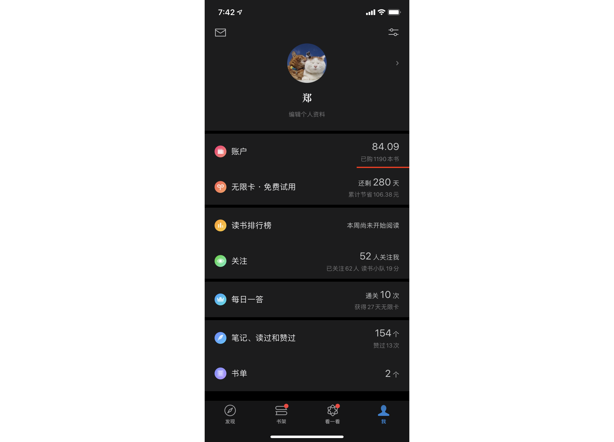
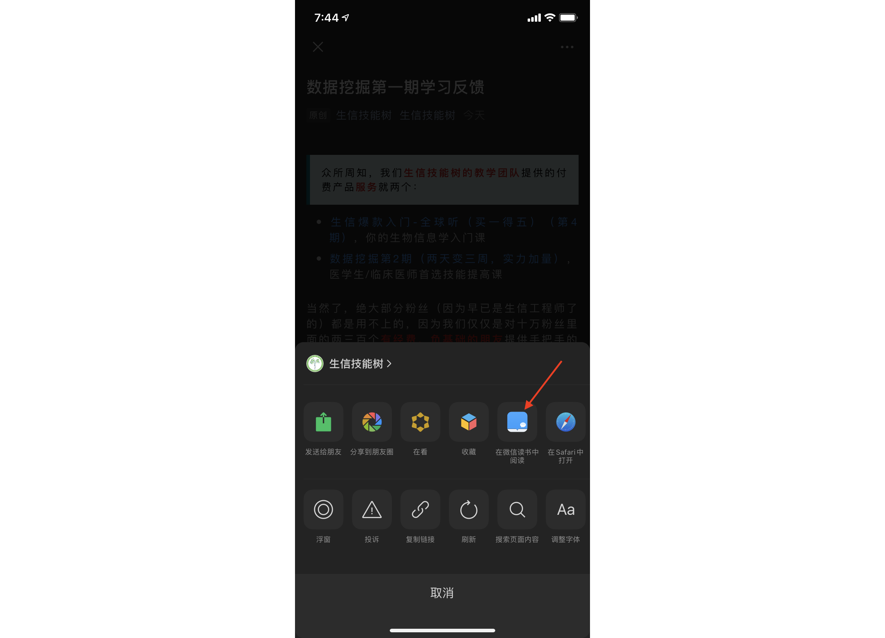

今天要推荐的就是腾讯的很良心的app，微信读书。如果使用过的人应该都知道它怎么良心，基本上只要参与周末的组队抽无限卡，目前可以免费阅读里面的任何书籍，也包括听里面的有声书。下面我来介绍一下微信读书一些良心的地方。

## 组队抽无限卡

目前微信读书，每周都可以组队参与抽无限卡的活动，5人成一队，周六中午12点开奖，当你队伍中越多新人时，越有可能抽到更多天数的无限卡，甚至是终身无限卡；给大家看一下，我领取的无限卡，目前已经使用464天了，而我领取的无限卡还剩余280天。

大家可以选择与好友、家人一起组队，但是因为微信读书默认每次组队，队员不能与上周队伍完全一样，所以我推荐一个神器给大家——[微信读书助手](https://weread.qnmlgb.tech/)。

这个网站打开，扫其中的二维码就可以参与组队，不单止有每周无限卡的组队，还有联名卡、翻一翻的组队，另外，如果想做队长，也可以提交自己的链接。

该网站还有[对应的Chrome插件](https://chrome.google.com/webstore/detail/%E8%AF%BB%E4%B9%A6%E5%8A%A9%E6%89%8B/ibdcjnicihdkclgpgepkfcenbjekgmia)，安装该插件后，在微信读书网页版，可以组队、导出读书笔记等功能。

另外，最近还有一款Chrome插件——[小悦记](https://mp.weixin.qq.com/s/hCZWQEfHrCAxTiO0h8ukJw)也是主打管理微信读书的读书笔记。

## 每周领取书籍

微信读书每周都可以领取书籍或者是有声书，而且每周送的数目还不少。以前是可以分享链接然后返回就可以领取，但现在需要有好友点击链接后，你才能领取到；目前我已经领取了1190本书。

## 读书时长~~换书币~~兑无限卡

为了鼓励阅读，微信读书可以使用你每周的读书时长，去兑换无限卡（以前是书币，目前书币只能参与答题来赢取了），读书每满1小时、3小时、5小时候，均可兑1天无限卡；每周最多兑3天无限卡，但听书超过2小时后，不计入读书时长。

## 订阅微信公众号

微信读书还有一个不得不提的功能，那就是订阅公众号。

微信的公众号文章一直都是很封闭的，采用rss去订阅某些抓取的引擎，效果一直不好。

而微信读书由于是微信自己家的app，所以效果非常好，更新也非常及时。

最常用的方法就是，在公众号文件里点击右上角的“。。。”，然后选取“在微信读书中阅读”，就可以在微信读书中打开该文章，并且可以将该公众号添加到书架中（完成订阅）。

## 听书

最后一个比较良心的功能就是听书，在通勤时间，我们可以在比较摇晃的车里，用耳朵去听书，而不是打开手机来看，让人感觉舒服很多。

微信读书有很多真人朗读的有声书，但也支持使用电脑合成的人声去读你要看的书，比如你可以边走在路上，边听你想看的公众号。

## Kindle也支持微信读书啦

目前打开[微信读书-墨水屏版](https://ink.qq.com/)的网站，点击安装指引，我们可以看到，市面上很多安卓系统作为底层的电纸书，微信读书都支持安装。

但是由于Kindle不是安卓系统，所以目前只能通过Kindle原生浏览器，打开微信读书的网站，进行阅读。

支持更多的设备，在电脑上、在电纸书、在手机上都能看，而且能够看公众号，目前看书基本免费，微信读书相比于亚马逊Kindle，可以说是很能打了。