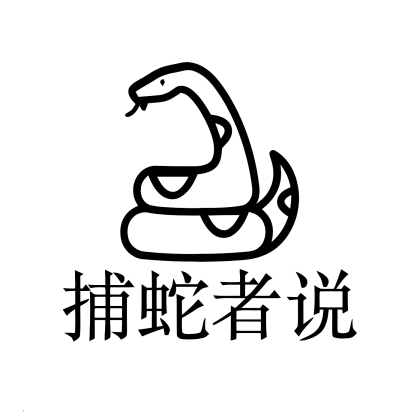

[捕蛇者说](https://pythonhunter.org/)是去年才出现的一档关于Python的播客节目，自从比特新声、IT公论等一堆科技类播客停播，我的播客list中的程序员主讲的播客节目便非常之少，而捕蛇者说又刚好是主要与Python相关的一档播客节目。Python在我日产工作中经常用到，倾听一群大厂的主播们分享他们对于Python、程序员软技能的看法让我倍感亲切也获益良多。

很好的一点是，每次节目里，主播们都会推荐一些很好的包或者文章/视频，在官网的shownotes中均会列出。