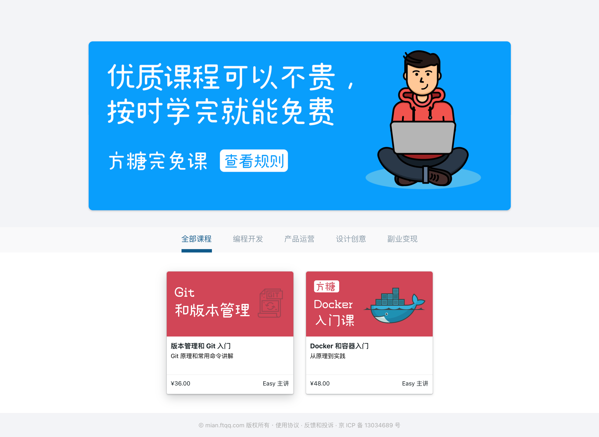

说Easy，或者方糖气球有些人可能不清楚，但是如果说Server酱的作者，大家可能都知道。

Easy推出了[方糖完免课](https://mian.ftqq.com/course)，目前有[Docker和容器入门](https://mian.ftqq.com/course/detail/23)、[版本管理和Git入门](https://mian.ftqq.com/course/detail/24)2门课了，虽然这2门课对某些人来说，比较初级，但是值得推荐的是，你只要在规定的时间里学习完，如[Docker和容器入门](https://mian.ftqq.com/course/detail/23)是7天哪学习完120分钟的课，那么就可以全额退款（[查看规则](https://mian.ftqq.com/rules.post)）。

第一个课程[Docker和容器入门](https://mian.ftqq.com/course/detail/23)目前已经有300多人学习了，完成率也有77%，我自己也在学，还是学有所得的，而且这门课也就120分钟，我也不会贩卖焦虑，也没收钱，就是给大家分享这个机会。