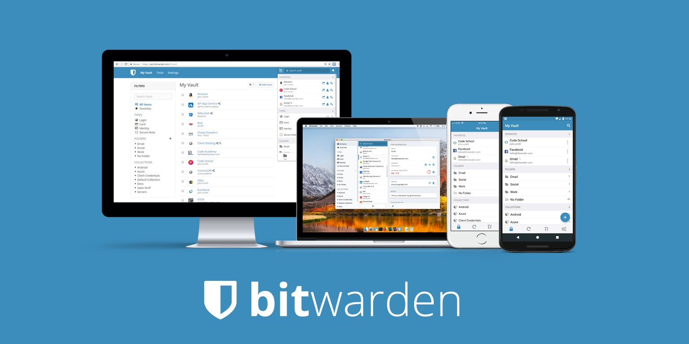
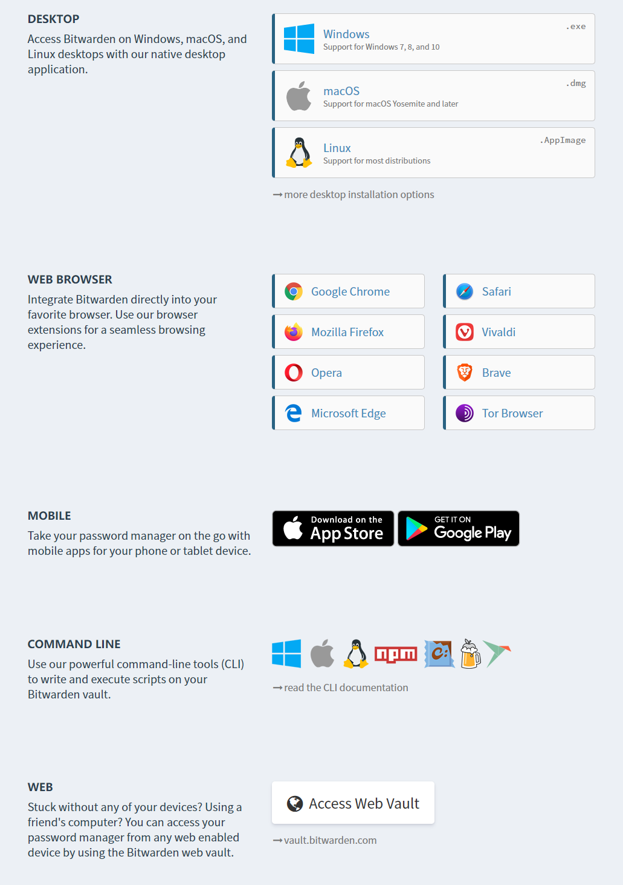
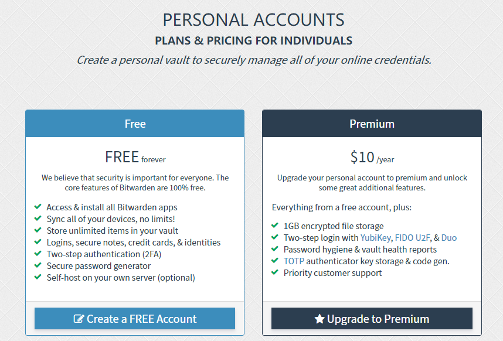
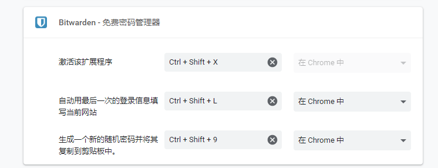

曾经使用过lastpass、1password等密码管理软件，这些软件都非常好用，能兼容多种主流平台，不过订阅的费用不菲，我使用的时候都是免费试用一年。

在去年的感恩节1password免费试用到期后，我就寻找有没有免费的、能兼容多种主流平台的好用的密码管理软件，而且使用体验也不亚于lastpass和1password的。结果很幸运地找到了[Bitwarden]([https://bitwarden.com/](https://bitwarden.com/))。

[Bitwarden]([https://github.com/bitwarden](https://github.com/bitwarden))是一款开源的密码管理软件，有着最基本的随机生成密码、保存密码、自动填写密码的功能，并且在Win、IOS、macOS等主流平台上都有app，以及浏览器插件。而且如果你担心安全，你可以自己搭建服务。

Bitwarden是完全免费的，但是你如果有更高的要求，也可以选择自己搭建，或者是使用官方服务器的Premium服务，每年10刀，其实有点像捐助。

最后一个小tips：如果你是用Bitwarden的chrome插件，默认是没有快捷键的，每次使用都要点击那个图标，有点麻烦，那么你可以在chrome地址栏，输入`chrome://extensions/shortcuts`，然后在Bitwarden里对应设置快捷键，这里我设置了与1password一样的“Ctrl+Shift+X”（习惯了这个快捷键了）。

