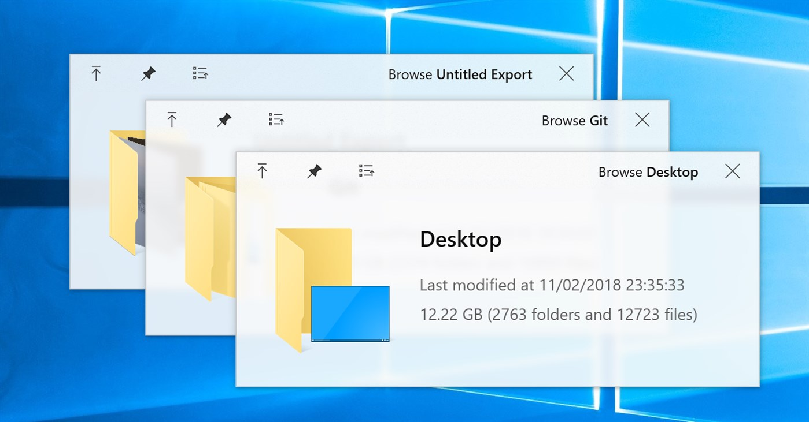
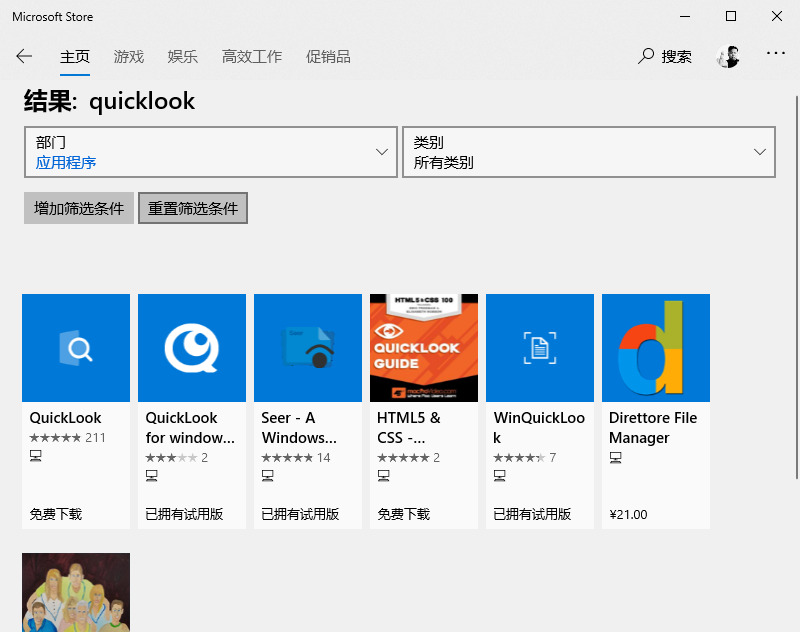
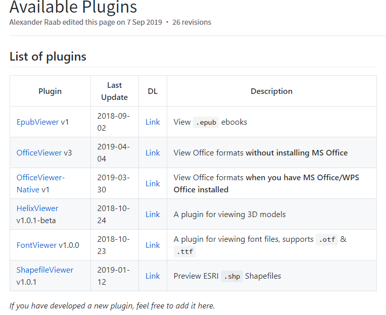

用过macOS系统的朋友都知道，在mac下，当前文件按一下空格，就能打开一个预览窗口，这在查找文件以及有时只需要稍微查看一下文件内容时，十分方便，不用一个个文件去点开。

本来Win下也有默认的预览窗口，就在文件管理器的侧边栏会打开一个窗口，但是开启了这个窗口，如果遇到大文件，会卡顿很久才加载出来，而且有点丑。

于是[QuickLook]([https://github.com/QL-Win/QuickLook](https://github.com/QL-Win/QuickLook))就成为一款优秀的解决该需求的软件！而且QuickLook还是一款**免费的开源软件**，用户既可以在Github上下载安装，也支持在Win10的应用商店免费下载。

现在我们打开Win10 应用商店，搜索“quicklook”，会显示有数款软件，包括QuickLook、Seer、WinQuickLook等。

而我试用了一圈，还是QuickLook比较好用，特别是有一个Feature，我用的文件管理器是Directory Opus，而不是Win默认的，这些软件很多都不支持Directory Opus下的预览。

关于QuickLook，为了支持Word或者Excel的预览，我们需要安装插件：在[https://github.com/QL-Win/QuickLook/wiki/Available-Plugins](https://github.com/QL-Win/QuickLook/wiki/Available-Plugins) 这个页面，我们可以根据是否有安装Office或者WPS来选择插件，如果没有安装，选择`OfficeViewer v3`，否则选择`OfficeViewer-Native v1`。安装方法很简单，下载插件，在该文件上按空格预览，点击install，然后重启QuickLook即可。

## 一点题外话

其实Win下的预览软件，我用了好几年了，一开始是用的Seer，而Seer一开始的使用体验还是不错的，后来转为收费版也无可厚非。不过前几年Seer有一次深陷抄袭源码的风波，使得我转投QuickLook的怀抱。刚好我记得这件事，今天又去查了一下，发现当时承诺开源的1.5.0版本的源码，Seer的作者早就删除，现在Seer仍旧上架收费。

