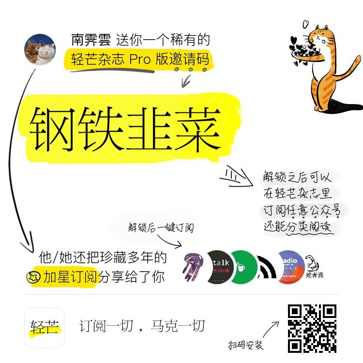
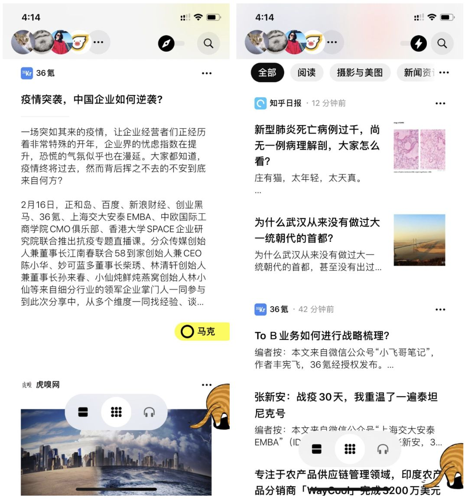
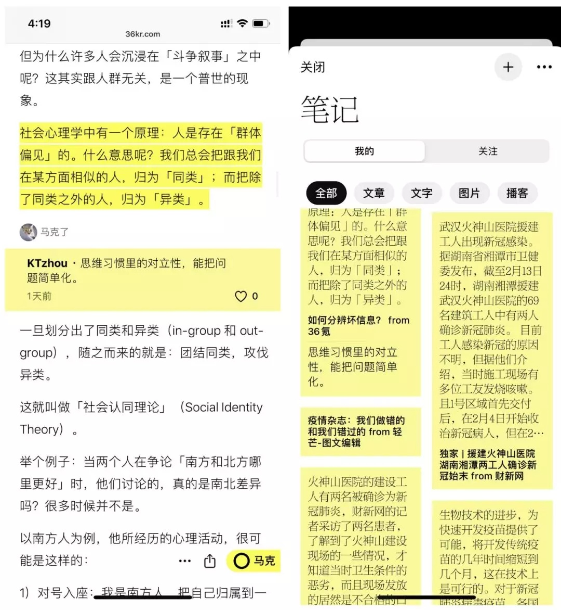

更新：

目前轻芒已经准备正式版了，使用以下的二维码，扫码下载后，输入图中的不限次数邀请码即可。



-----

轻芒草稿版是轻芒团队重新打造的一款app，目前还在内测中，主打的功能是可在app中订阅**包括微信公众号、播客**在内的RSS服务，适合中重度的RSS用户。



除了可以方便地在app中阅读你订阅的内容，轻芒草稿版还提供“马克”功能，你可以用来“马克”待读的文章，以及做笔记。



想要了解更多的可以查看：[轻芒阅读的老用户，有人找。](https://zhuanlan.zhihu.com/p/107619052)以及[草稿版的问题解决了没？](https://qingmang.me/articles/-4171373491815877649/?fulltext=1)，了解更多目前内测版的进度。

我已经参与内测一段时间了，感觉使用起来还不错。目前内测的用户可以邀请新用户，但是目前只有IOS版；邀请的数目是每周更新的，视乎服务器的压力而定，有时1个有时3个，不用的话，每周也会浪费掉。

所以如果有感兴趣的朋友，请在本文下方评论，或者直接发送邮件到ryu@zhengzexin.com；评论或邮件的内容如下

```
 1. 你的邮箱
 2. 你的微信ID
```

我提交邀请之后，迟点就会有轻芒的工作人员来邀请你内测，添加你的微信好友。